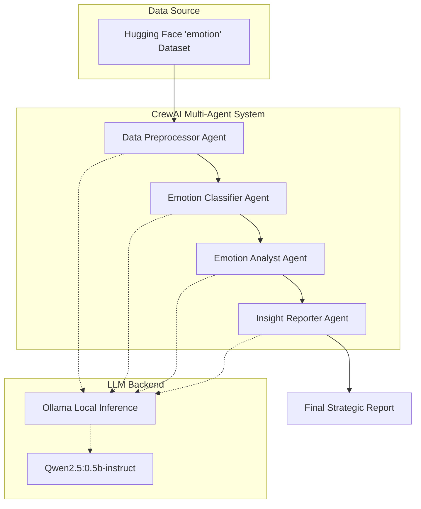

# Local CrewAI Emotion Analyst

[](https://www.linkedin.com/in/maryam-haroon-ba51b8287/)


> **Autonomous Multi-Agent System for Advanced Psychological Text Analysis.**

This project implements a sophisticated **Agentic AI Pipeline** leveraging **CrewAI** and local Large Language Models (LLMs) via **Ollama**. It simulates a full data science team—comprising a Data Preprocessor, Emotion Classifier, Analyst, and Insight Reporter—to autonomously process, analyze, and derive actionable psychological insights from the **Hugging Face Emotion dataset**. It bridges the gap between raw textual data and high-level human understanding through orchestrated agent collaboration, demonstrating the power of decentralized AI in **Natural Language Processing (NLP)** and **Affective Computing**.

---

## 1. Skills & Technologies

### Languages

- **Core:** Python 3.10+, Asynchronous Programming, Object-Oriented Programming (OOP)
- **Syntax:** Type Hinting, Decorators, f-strings, Docstrings
- **Scripting:** Automation Scripts, CLI Tools, Argument Parsing

### Frameworks & Libraries


- **Orchestration:** CrewAI (Agents, Tasks, Process, Crew)
- **Data Manipulation:** Pandas (DataFrames, Series, Aggregation), NumPy integrations
- **Data Loading:** Hugging Face `datasets` (Load, Split, Cache Management)
- **Utilities:** Pydantic (Data Validation), Requests (HTTP)

### ML / DL / NLP


- **Models:** Large Language Models (LLMs), Qwen2.5-0.5b-instruct
- **Techniques:** Zero-Shot Classification, Chain-of-Thought (CoT) Reasoning, Role Prompting, In-Context Learning
- **Tasks:** Sentiment Analysis, Emotion Recognition, Text Summarization, Information Extraction
- **Inference:** Ollama Local API, Model Quantization aware

### Tools & Platforms


- **Development:** VS Code (Extensions, Debugging), Jupyter Notebooks (Prototyping)
- **Version Control:** Git, GitHub (Actions, Repo Management)
- **Environment:** Pip, Virtualenv, Conda

### Data Engineering
- **Pipeline:** ETL (Extract, Transform, Load) for Text Data
- **Preprocessing:** Text Normalization, Noise Removal, Tokenization strategies
- **EDA:** Exploratory Data Analysis, Statistical Distribution, Data Visualization readiness

---

## 2. Project Description

The **Local CrewAI Emotion Analyst** is an end-to-end automated research pipeline designed to analyze emotional patterns in text. Instead of a monolithic script, it deploys a **crew of specialized AI agents**, each with a distinct role, goal, and backstory. These agents collaborate sequentially to read raw data, clean it, perform classification tasks, statistically analyze the results, and finally generate human-readable reports on emotional well-being.

This architecture ensures **modularity**, **scalability**, and **explainability**, as each step of the process is handled by a dedicated entity with specific instructions.

---

## 3. Problem Statement

Analyzing large volumes of unstructured text for emotional content is a challenge in **Computational Linguistics**. Traditional methods often rely on simple keyword matching or black-box models that lack context. Furthermore, extracting *actionable insights* from these classifications typically requires manual intervention by domain experts. There is a critical need for systems that can not only classify data but also **understand, contextualize, and report** on it autonomously, reducing the cognitive load on human analysts.

---

## 4. Solution Overview

The solution is a **Multi-Agent Orchestration Framework** that breaks down the analysis process into four distinct phases:

1.  **Data Ingestion & Preprocessing:**
    *   Loads the 'emotion' dataset from Hugging Face.
    *   **Agent:** *Data Preprocessor* cleans text, removes noise, and normalizes inputs.
2.  **Semantic Classification:**
    *   Uses a local LLM (Qwen2.5 via Ollama) to interpret text.
    *   **Agent:** *Emotion Classifier* predicts emotional states based on semantic context, validating against ground truth.
3.  **Statistical Analysis:**
    *   Aggregates classification results and dataset statistics.
    *   **Agent:** *Emotion Analyst* identifies distribution patterns (e.g., prevalence of 'joy' vs 'sadness').
4.  **Insight Generation:**
    *   Synthesizes findings into actionable advice.
    *   **Agent:** *Insight Reporter* produces a final strategic report.

---

## 5. System Architecture



---

## 6. Workflow

1.  **Initialization:** The system ensures the local Ollama instance is serving the LLM.
2.  **Ingest:** The `datasets` library pulls the training split of the emotion dataset.
3.  **Task A (Clean):** The Preprocessor agent iterates through samples to standardize text.
4.  **Task B (Classify):** The Classifier agent receives cleaned text and determines the dominant emotion.
5.  **Task C (Analyze):** The Analyst agent looks at global statistics (pre-calculated distributions) and agent outputs to find trends.
6.  **Task D (Report):** The Reporter agent drafts a structured conclusion with advice.
7.  **Output:** Final output is printed to the console and returned as an execution result.

---

## 7. Folder Structure

```txt
Local-CrewAI-Emotion-Analyst/
├── basic_research_crew.py       # Minimal example of CrewAI research agent
├── emotion_analysis_crew.py     # MAIN PIPELINE: The core multi-agent system
├── inspect_emotion_dataset.py   # Utility script for data exploration & EDA
├── requirements.txt             # Python dependencies
└── README.md                    # Project documentation
```

---

## 8. Features

*   **Autonomous Agent Collaboration:** Agents pass context and data between each other without hardcoded logic paths.
*   **Local Privacy-First Inference:** Runs entirely on local hardware using Ollama, ensuring no data leaves the machine.
*   **Role-Playing AI:** Agents utilize "backstories" to adopt specific personas (e.g., "Expert Data Scientist"), improving output quality.
*   **Extensible Design:** New agents (e.g., a "Visualizer") can be added to the crew definition with minimal code changes.
*   **Data Validation Utility:** Includes a standalone script to inspect cache, features, and label mappings of the dataset.

---

## 9. Research Paper vs Implementation

This implementation focuses on **Applied Agentic Workflows** rather than novel model architecture. It demonstrates the practical application of **Chain-of-Thought (CoT)** and **Role-Prompting** within a structured multi-agent environment, aligning with recent research in *Communicative Agents for Software Development* and *Autonomous Data Analysis*.

---

## 10. Installation & Setup

### Prerequisites
*   **Python 3.10+**
*   **Ollama** installed and running.

### Steps

1.  **Clone the Repository**
    ```bash
    git clone https://github.com/maryam-haroon/Local-CrewAI-Emotion-Analyst.git
    cd Local-CrewAI-Emotion-Analyst
    ```

2.  **Install Dependencies**
    ```bash
    pip install -r requirements.txt
    ```

3.  **Setup Local LLM**
    Pull the lightweight Qwen model (or any model of choice):
    ```bash
    ollama pull qwen2.5:0.5b-instruct
    ```

---

## 11. Usage

### Run the Main Pipeline
To execute the full emotion analysis crew:
```bash
python emotion_analysis_crew.py
```

### Run the Basic Research Demo
For a simple "Hello World" agent test:
```bash
python basic_research_crew.py "Future of Artificial Intelligence"
```

### Inspect Data
To view dataset properties and sample rows:
```bash
python inspect_emotion_dataset.py
```

---

## 12. Results / Outputs

**Example Output (Console):**

```text
...
[2024-05-20 10:00:00][INFO]: Starting Task: Review the emotion dataset...

> Human Input: None
> Agent: Emotion Analyst
> Thought: I need to allow the statistics...
> Final Answer: The dataset shows a high prevalence of 'joy' (33%) followed by 'sadness' (29%)...

[2024-05-20 10:00:05][INFO]: Starting Task: Provide 3 actionable insights...

FINAL RESULT:
1. **Promote Positive Reinforcement:** Given the high frequency of joy...
2. **Early Intervention for Sadness:** The significant portion of sadness data points suggests...
3. **Anger Management Modules:** While less frequent, anger clusters indicate...
```

---

## 13. Future Improvements

*   **Model Fine-Tuning:** Fine-tune a specific adapters for the local LLM on the emotion dataset for higher classification accuracy.
*   **Multimodal Analysis:** Integrate audio or facial expression data if available in future dataset iterations.
*   **Vector Database Integration:** Use tools like ChromaDB to store agent memories and analysis history for long-term trend tracking.
*   **Web Dashboard:** Build a Streamlit or Chainlit interface to visualize agent interactions in real-time.

---

## 14. License

This project is licensed under the **MIT License**.

---

## 15. Author

**Maryam Haroon**  
*AI / Machine Learning Engineer | Data Scientist*

[](https://www.linkedin.com/in/maryam-haroon-ba51b8287/)
